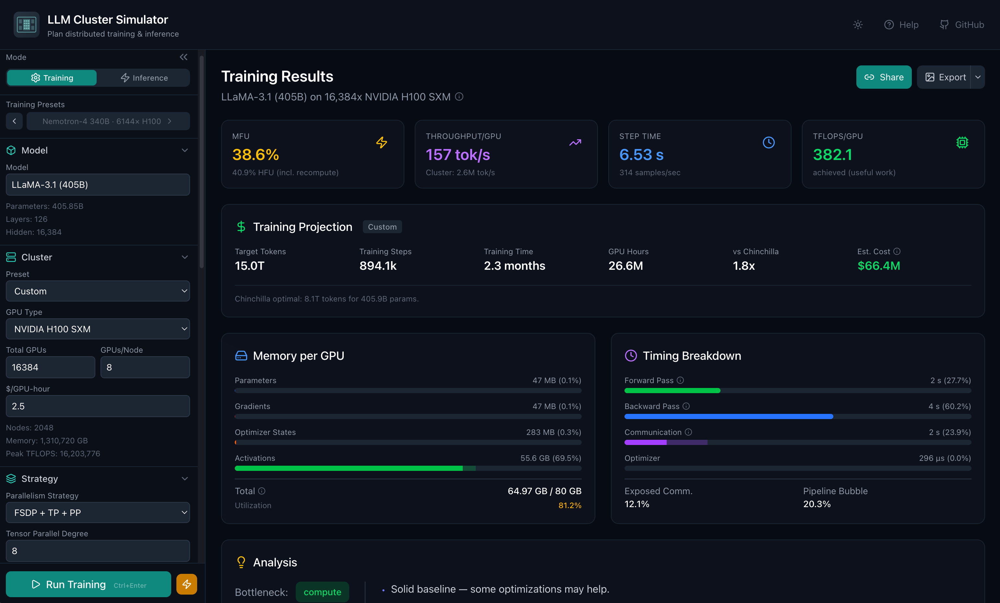
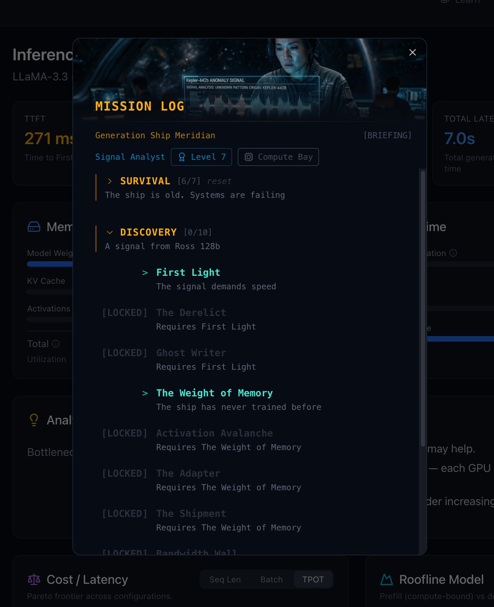

# LLM Cluster Simulator

[](https://doi.org/10.5281/zenodo.19365122)

Analytical simulator for distributed LLM training and inference. Estimates MFU, memory, throughput, and cost for any model–cluster–parallelism combination without provisioning a single GPU. All computation happens client-side; no backend, no data leaves your browser.


**[Try it →](https://simulator.zhebrak.io/)**



## Why This Exists

Planning distributed training and inference sizing today means either booking cluster time to run experiments or relying on back-of-envelope math that breaks down the moment you add pipeline parallelism, expert parallelism, or mixed-precision communication. This simulator replaces both with a first-principles physics model: FLOPs, bytes transferred, pipeline bubbles computed analytically from hardware specs, model architecture, and parallelism layout.

Best for sweeping strategies, sanity-checking cluster budgets, and building intuition for parallelism tradeoffs — not a substitute for profiling production workloads.

## What You Can Answer

**Training**
- How many H100s do I need to train a 70B model in 30 days, and what's the cost?
- What MFU should I expect for LLaMA 405B at 8K vs 131K with context parallelism?
- What's the optimal parallelism layout for DeepSeek V3 on 256× H800 with FP8 and expert parallelism?

**Inference**
- What's the TTFT/TPOT for LLaMA 70B on 8×H100 with speculative decoding?
- Can LLaMA 70B run on 2× RTX 4090 in INT4 with paged attention?
- How does continuous batching throughput scale with batch size and TP degree?

**Try it yourself:**
[DeepSeek V3 on 2048× H800](https://simulator.zhebrak.io?preset=deepseek-v3-r1) · [LLaMA 3.1 405B on 16K× H100](https://simulator.zhebrak.io?preset=llama3-405b)


## Benchmarks
The physics model is calibrated against published training runs.

| Model | GPUs | Strategy | Sim MFU | Published MFU | Source |
|-------|------|----------|---------|---------------|--------|
| LLaMA 3.1 405B | 16384× H100 | 3D (TP8 PP16) | 41.1% | ~40% | [Meta](https://arxiv.org/abs/2407.21783) Table 4 |
| LLaMA 3.1 405B 131K | 16384× H100 | 3D + CP16 | 37.2%\* | 38%\* | [Meta](https://arxiv.org/abs/2407.21783) Table 4 |
| DeepSeek V3 671B FP8 | 2048× H800 | 3D + EP32 | 44.7% | 43.7% | [DeepSeek](https://arxiv.org/abs/2412.19437) §3.1 |
| Nemotron-4 340B | 6144× H100 | 3D (TP8 PP12) | 41.2% | 41-42% | [NVIDIA](https://developer.nvidia.com/blog/train-generative-ai-models-more-efficiently-with-new-nvidia-megatron-core-functionalities/) Table 2 |
| OLMo 3 32B | 1024× H100 | FSDP (DP=1024) | 43.4% | ~41% | [OLMo 3](https://arxiv.org/abs/2512.13961) (selective AC) |

\* Model FLOPs MFU — quadratic attention FLOPs at long sequences ([Benchmarks](docs/BENCHMARKS.md))


## Features

- **70+ models** — LLaMA, DeepSeek, Qwen, Mistral, Gemma, Phi, Grok, GLM, OLMo, Kimi, and more. Dense, MoE, MLA, GQA.
- **25 GPUs** — A100 through B200, MI300X, RTX 4090, A800/H800. Consumer to datacenter.
- **Full parallelism stack** — DDP, ZeRO, FSDP, TP, PP (1F1B / Interleaved / DualPipeV), CP, SP, EP.
- **Auto-optimizer** — Finds the fastest parallelism layout automatically.
- **Inference** — TTFT, TPOT, speculative decoding, continuous batching, GGUF/GPTQ/AWQ, KV cache sizing.
- **Training** — LoRA/QLoRA, FP8/FP4 mixed precision, selective activation checkpointing, cost projection.


#### What it does not model
- Fused and custom kernels (FA3), NVMe/CPU offloading, runtime optimisations.
- Serving frameworks (vLLM/TensorRT), disaggregated prefill/decode, dynamic batching, prefix caching.
- Post-training: RLHF, RLVR, PPO, GRPO.
- Non-training overhead: checkpointing, data loading, failure recovery.
- TPUs, Trainium/Inferentia, non-IB clusters.


## Learning

- **[Learn Mode](docs/LEARNING.md#learn-mode)** — 60 structured tasks across 6 tracks (training and inference, beginner to advanced). Each task sets up a scenario, defines success criteria, and provides progressive hints. Enter via the **Learn** button in navigation panel.
- **[Space RPG](docs/LEARNING.md#space-rpg)** — a narrative campaign teaching the full parallelism stack through a branching story with hardware unlocks, skill progression, and multi-objective challenges. Enter via the **Play** button in navigation panel.

<p align="center">

</p>


## Documentation

- [Overview](docs/OVERVIEW.md) — Architecture, definitions, reading guide.
- [Physics](docs/PHYSICS.md) — Simulation formulas, constants, rationale.
- [Strategies](docs/STRATEGIES.md) — Parallelism strategy implementations.
- [Hardware](docs/HARDWARE.md) — GPU specs, interconnects, topology.
- [Models](docs/MODELS.md) — Model registry, architecture types, FLOPs.
- [Inference](docs/INFERENCE.md) — Inference latency, KV cache, speculative decoding.
- [Optimizer](docs/OPTIMIZER.md) — Recommendation engine, auto-optimizer.
- [Learning](docs/LEARNING.md) — Learn Mode tasks, Space RPG missions.
- [Benchmarks](docs/BENCHMARKS.md) — Calibration data and known gaps.

## Development

```bash
npm install
npm run dev
npm run test
npm run build
```

**Stack:** React 19 · TypeScript · Vite 7 · Tailwind CSS 4 · Zustand · Vitest

## Citation

If you use this simulator in your work, please cite:

```bibtex
@misc{zhebrak2026llmclustersim,
  author       = {Zhebrak, Alex},
  title        = {{LLM Cluster Simulator}: Interactive Distributed Training and Inference Planning},
  year         = {2026},
  url          = {https://github.com/zhebrak/llm-cluster-simulator},
  doi          = {10.5281/zenodo.19365122},
  note         = {Browser-based simulator for GPU cluster parallelism strategies, calibrated against published benchmarks from Meta, DeepSeek, and NVIDIA}
}
```

## License

MIT
